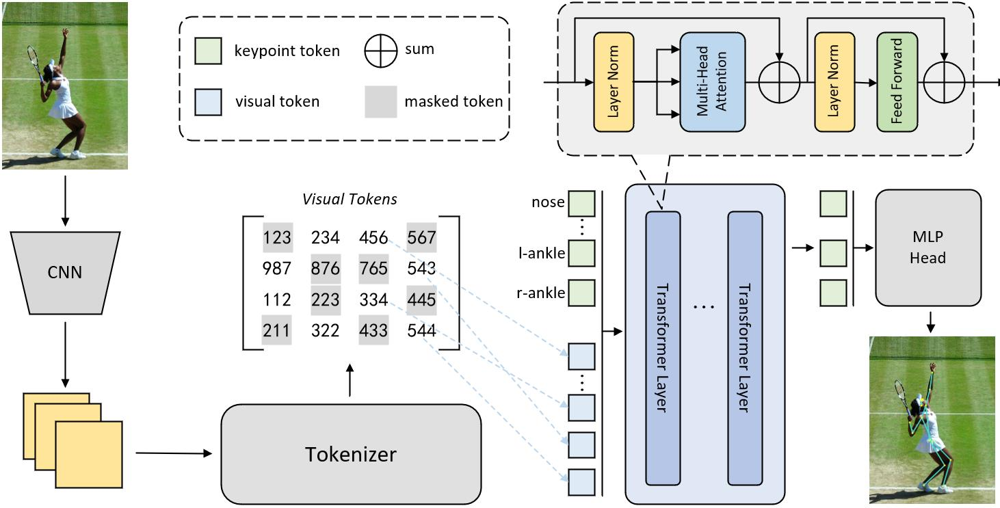

# Token Masked Pose Transformer are Efficient Learner

In recent years, Transformer has achieved remarkable results in computer vision. Its built-in attention layers can effectively model the global dependency relationships of images by transforming image features into token forms as inputs to the Transformer. This paradigm has become deeply ingrained in the community. However, it comes at a high computational cost. To address this issue, we propose Token Masked Pose Transformers are Efficient Learners (tmpose) inspired by the concept of Masked Image Modeling (MIM) in self-supervised learning. To construct an efficient Transformer network for pose estimation, we apply semantic-level masking to the tokens in the network. Additionally, we introduce three different masking methods. Through these simple techniques, we have achieved impressive results. We observed negligible accuracy loss on the COCO Validation dataset while reducing the computational complexity measured in GFLOPsT by 60%. Furthermore, we conducted tests on the MPII dataset, where we achieved competitive results.



The contributions of this work are summarized as follows:

- The present study introduces a highly efficient pose estimation network called TMPose by employing partial token masking. To the authors' knowledge, using masks in pose estimation is not commonly observed in the field.

- This article discusses the results of three different mask types and various mask ratios, providing a comprehensive exposition of TMPose's performance.

- We conducted experiments on public benchmark datasets, and our TMPose achieved highly competitive results in speed and accuracy. Specifically, while minimizing the loss to a minimal extent, our TMPose exhibited a 60% reduction in GFLOPsT (the computational complexity of the Transformer).

  # Quick use

  ## 1. Data preparation

  **For MPII data**, please download from [MPII Human Pose Dataset](http://human-pose.mpi-inf.mpg.de/). The original annotation files are in matlab format. We have converted them into json format, you also need to download them from [OneDrive](https://1drv.ms/f/s!AhIXJn_J-blW00SqrairNetmeVu4) or [GoogleDrive](https://drive.google.com/drive/folders/1En_VqmStnsXMdldXA6qpqEyDQulnmS3a?usp=sharing). Extract them under {POSE_ROOT}/data, and make them look like this:

  ```
  ${POSE_ROOT}
  |-- data
  `-- |-- mpii
      `-- |-- annot
          |   |-- gt_valid.mat
          |   |-- test.json
          |   |-- train.json
          |   |-- trainval.json
          |   `-- valid.json
          `-- images
              |-- 000001163.jpg
              |-- 000003072.jpg
  ```

  **For COCO data**, please download from [COCO download](http://cocodataset.org/#download), 2017 Train/Val is needed for COCO keypoints training and validation. We also provide person detection result of COCO val2017 and test-dev2017 to reproduce our multi-person pose estimation results. Please download from [OneDrive](https://1drv.ms/f/s!AhIXJn_J-blWzzDXoz5BeFl8sWM-) or [GoogleDrive](https://drive.google.com/drive/folders/1fRUDNUDxe9fjqcRZ2bnF_TKMlO0nB_dk?usp=sharing). Download and extract them under {POSE_ROOT}/data, and make them look like this:

  ```
  ${POSE_ROOT}
  |-- data
  `-- |-- coco
      `-- |-- annotations
          |   |-- person_keypoints_train2017.json
          |   `-- person_keypoints_val2017.json
          |-- person_detection_results
          |   |-- COCO_val2017_detections_AP_H_56_person.json
          |   |-- COCO_test-dev2017_detections_AP_H_609_person.json
          `-- images
              |-- train2017
              |   |-- 000000000009.jpg
              |   |-- 000000000025.jpg
              |   |-- 000000000030.jpg
              |   |-- ... 
              `-- val2017
                  |-- 000000000139.jpg
                  |-- 000000000285.jpg
                  |-- 000000000632.jpg
                  |-- ... 
  ```

  

  ## 2. Trainging

  ### Training on COCO train2017 dataset 

  ```
  python tools/train.py \
      --cfg experiments/coco/tmpose/tmpose_L_D24_256_192_patch43_dim192_depth24_heads12.yaml\
  ```

  ### Training on MPII dataset 

  ```
  python tools/train.py \
      --cfg experiments/mpii/tmpose/tmpose_l_D6_256x256_patch44_dim192_depth6.yaml\
  ```

  ## 3. Testing

  ### Testing on COCO val2017 dataset using TRAINED models

  ```
  python tools/test.py \
      --cfg experiments/coco/tmpose/tmpose_L_D24_256_192_patch43_dim192_depth24_heads12.yaml\
      TEST.MODEL_FILE _PATH_TO_CHECKPOINT_ \
      TEST.USE_GT_BBOX True
  ```

  ### Testing on MPII dataset using TRAINED models

  ```
  python tools/test.py \
      --cfg experiments/mpii/tmpose/tmpose_l_D6_256x256_patch44_dim192_depth6.yaml\
      TEST.MODEL_FILE _PATH_TO_CHECKPOINT_ 
  ```


# Acknowledgement

Thanks for the open-source:

> [HRNet](https://github.com/leoxiaobin/deep-high-resolution-net.pytorch/), [TokenPose](https://github.com/leeyegy/TokenPose)

